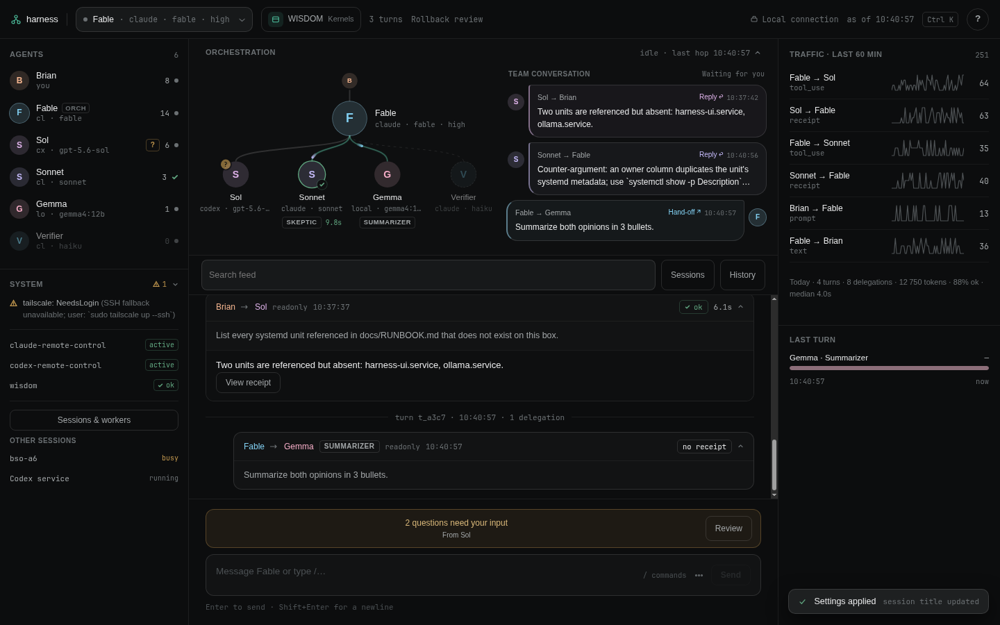

# Harness UI

A live workspace for your coding-agent team. Talk to an orchestrator such as
Astra, watch real exchanges with Claude and Codex workers, answer questions,
and return to saved work from your desktop or phone.

**UI 0.8.0 · requires [Agent Harness core](https://github.com/obrienbrian/agent-harness) 0.6.0**



*Sample data from the browser fixtures.*

## Your workspace

| Control | What it does |
| --- | --- |
| Session setup | Choose the orchestrator, model, effort, working directory, permission mode, and session title. |
| AI Kernel library | Select included instructions or upload your own Markdown operating standard. |
| Questions | Answer requests escalated by the orchestrator or raised by a direct worker. |
| Agent graph and exchanges | Follow actual handoffs and results with speech bubbles, role labels, and bounded animation. |
| Sessions | See active agents and stop workers or end a session. |
| History | Find named work, inspect receipts, export Markdown, and follow up with a worker. |
| Help | Find supported commands and everyday instructions. |

Session titles describe your work independently of agent display names: a session
called “September rollout” can still be run by Astra. Renaming keeps the current
conversation. Starting a new session keeps its saved history.

The page works at desktop and phone widths, with dark/light themes, keyboard
controls, and reduced-motion support. It uses real events; there is no simulated
agent chatter. The frontend is one HTML file with vanilla JavaScript, CSS, and SVG,
with no build step, CDN, web fonts, or frontend dependencies.

## Run locally

Requirements: Linux, Python, the core repository, and at least one authenticated
official vendor CLI. Place the repositories beside one another:

```text
parent/
  agent-harness/
  agent-harness-ui/
```

```bash
bin/harness-ui                     # http://127.0.0.1:7788
bin/harness-ui serve --port 7790
```

Set `AGENT_HARNESS_ROOT=/absolute/path/to/agent-harness` if the core is elsewhere.
The core command `harness ui` opens this launcher too. To prepare a user service,
run `bin/harness-ui install-unit`, inspect its configuration, then enable it with
`systemctl --user enable --now harness-ui.service`.

For remote phone access and optional encrypted background notifications, follow
[Phone setup](docs/PHONE.md). The server remains on loopback; configured Tailscale
Serve access accepts only the chosen account and exact HTTPS origin.

## Answering your agents

A worker can return a question to the orchestrator. Astra should answer from your
instructions and available evidence when confident; otherwise it can escalate
the question to **Questions**. You see its source, context, suggested answers,
and a text box for your own response.

Submit once the current turn is idle. Your answer is saved before continuation
starts and carries the original task/receipt reference. Direct worker questions
resume their worker; escalated questions return to the orchestrator for the
worker follow-up. Pending questions survive restarts. Duplicate answers and
questions from a different session cannot trigger another task.

A failed or interrupted dispatch is shown for review, without automatic replay.
You can cancel a pending question. Native vendor approval dialogs and every
terminal-only command are not reproduced; see Help for the supported controls.

## AI Kernels

An AI Kernel is your agents' operating instructions. Open **AI Kernel library**
to select an included kernel, choose **None**, or upload `.md` files up to 256 KB.
Uploading does not activate a file; select it explicitly. Switching instructions
starts a new session and retains saved history.

WISDOM is one included integration and the default in this installation. You can
bring your own standard. Global and project instructions continue to apply.
The core's [WISDOM setup](https://github.com/obrienbrian/agent-harness#ai-kernels-and-wisdom)
explains the canonical source, compiler, loader, and shared verified cache.

## Permissions and controls

**Session setup → Agent → Permissions** offers:

- **Full access · no approvals** (default): files, commands, and network access.
- **Workspace · restricted**: restrict work through the vendor's workspace policy.
- **Read only**: restrict edits through the vendor's read-only/plan policy.

Change permissions while work is idle. Workers inherit the choice; read-only
worker tasks stay restricted. A setting cannot override an enclosing sandbox or
managed vendor policy. Headless restrictions deny operations outside their scope.

Type `/` in the composer to explore supported commands. Useful ones include
`/help`, `/kernel`, `/rename <title>`, `/sessions`, `/history`, `/status`, and
`/goal <objective>`. Native Codex goals can continue across turns, with pause,
resume, edit, clear, and an optional explicit token budget. Goals never resume
automatically after a server restart. `/clear` starts fresh and clears the visible
feed while keeping history; `/new` starts fresh and keeps the feed visible.

## Privacy and saved work

Vendor CLIs handle their own credentials. The UI reads core-managed private state
and writes through its APIs; it does not proxy subscription tokens. Host, Origin,
and optional bearer-token checks protect the local API. Phone access adds
Tailscale identity checks. The service worker does not cache API data or credentials.

Runtime data is stored under `~/.local/state/agent-harness`. Uploaded kernels and
team presets are under `~/.config/agent-harness`. Back up both to retain settings,
receipts, questions, and history.

## Development

- `harness_ui/server.py`: standard-library HTTP API.
- `harness_ui/index.html`: the complete frontend.
- `harness_ui/push.py`: optional encrypted background notifications.
- `tests/fixture_server.py`: deterministic local UI fixtures, with no model calls.

Run test modules in separate interpreters; each owns its test environment.
Core must be importable via the sibling checkout or `AGENT_HARNESS_ROOT`.
Chromium and Node enable the browser interaction suite; push tests require the
optional notification dependencies documented in the phone guide.

```bash
python3 -m unittest tests.test_ui
python3 -m unittest tests.test_collaboration
python3 -m unittest tests.test_mobile
python3 -m unittest tests.test_push
python3 -m unittest tests.test_page_smoke
```

See [API contract](docs/UI-CONTRACT.md), [release notes](docs/RELEASE-NOTES.md),
[design specification](docs/DESIGN-SPEC.md), and [test evidence](docs/TESTS.md).
